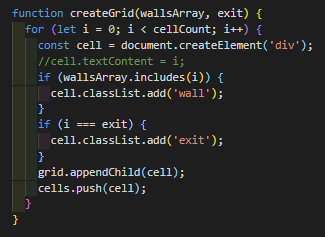
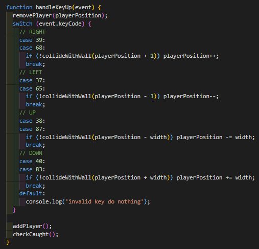
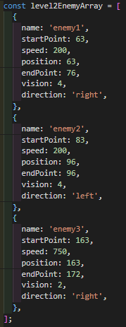
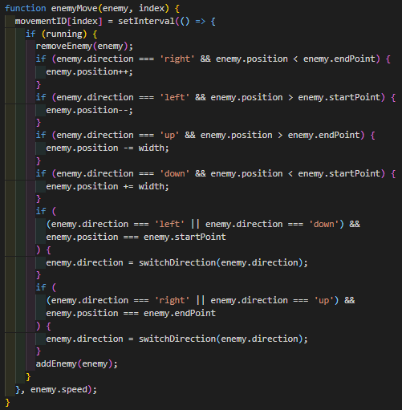
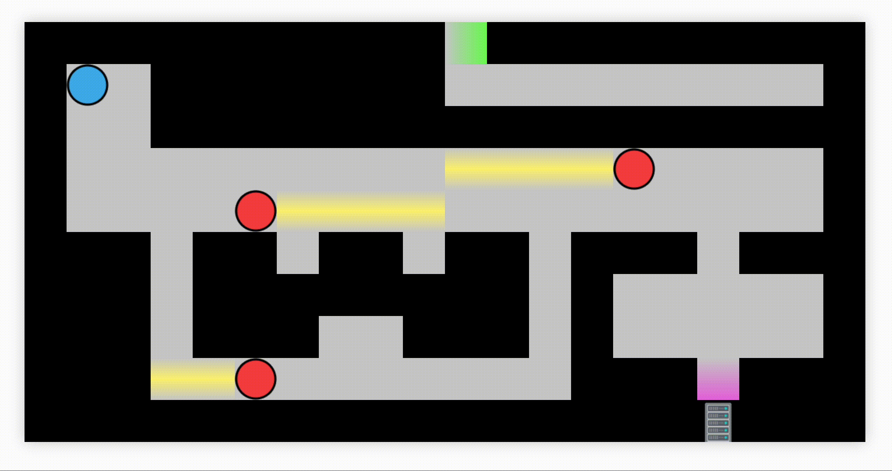

# Project 1 - 'Metal Gear Assembly'

Metal Gear Assembly is a 2D stealth adventure game, inspired by the Metal Gear Solid series. I made this as my first project for the General Assembly Software Engineering Immersive course, as an introduction to **JavaScript**.

**Technologies Used** - HTML, CSS, JavaScript

**Duration** - 7 days

**[Link](https://calum-m708.github.io/metal-gear-assembly/)**

## The Brief

Create a grid based game using HTML, CSS and JavaScript.

For a stealth game, I decided upon two requirements:

1. Game Over is triggered when the player collides with either an enemy or their vision
2. Players would have no way to defeat enemies - They must be avoided in order to complete objectives.

As an objective to aim for after getting the basic game built, I decided I wanted the game to have multiple levels, with different objectives and area design for each level.

## Game Overview

The gif below shows a player attempting the first level of the game, eventually being caught by the sight line of one of the enemies.

The walkable ground is a light grey, and the walls are black. The exit point is marked with a green gradient. The player is represented as a blue circle, and the enemies as red circles. The enemies line of sight is shown as a yellow gradient, somewhat reminiscent of a torch's light.

There are five levels. The aim of the game is to reach the exit point of each level while avoiding being seen by the enemy guards, as being spotted will trigger a Game Over screen. At the end of the game, you will be shown how many times you were caught.

## Technical Overview

While originally the whole game was built within one function, I decided to do a major refactor a few days into the project, splitting features into lots of more manageable functions, which would allow me to design multiple levels without repeating large chunks of code. See the Features List below for detailed explanations of the game's features and how they interact with each other. 

## Design notes

My original MVP (Minimum Viable Product) was to allow the player to play through one full level. However, once that was done, and the refactor mentioned at the beginning of the Technical Overview was complete, it became quite simple from a technical standpoint to create more levels. This allowed me time to get creative with the level design, hopefully providing the player with interesting styles of play. For example, Level 2 has two distinct paths - One with two quick patrolling guards that are difficult to avoid, and the other with only one slow moving guard, which requires the player to be more patient. 

Level 2 also introduces the Objective Timers, in a corner of the level where it is not possible to be caught while waiting for the timer to finish. This allows the player to be safely introduced to the timer mechanic, before the challenges of Levels 3 and 4, which both have their objective timers in the path of enemy patrols.

As the timers only count down while the player is standing in the pink gradient, there is an element of risk vs. reward, meaning players have to decide whether to be patient and take less risks, or play it less safe, but potentially complete the level quicker.

I had wanted the game to have a bit more of a linear difficulty curve, but after deploying the project and allowing others to play, it became clear that Level 3 was the most difficult of the game, and due to a feature I didn't have time to implement on Level 5, the last level is quite easy.

## Known bugs, other issues, and scope for improvement

I dealt with a few bugs in development, but most were resolved before the final deployment. The most major bug I'm aware of in the code is that the enemy's vision does not get blocked by walls, and if their line of sight extends outside of the grid, the enemy will promptly disappear. Due to the limited time I had to complete the project, rather than truly fix this bug, I ensured that the level design and the enemy paths never allowed their line of sight to reach a point where they would see through a wall or outside of the grid.

There were a few features I didn't have time to implement. The one that I feel detracts from the game the most is not having a countdown for the final level. Having a limited time to complete the final level was in my plan from the very beginning, but I simply didn't have time to add that feature.

Another feature I wanted to add was a hidden timer that kept track of how long it had been since you started the game. I already have a counter that shows how many times the player got caught by the enemy, but I think knowing how quickly you beat the game would add an element of replayability. 

In general, I would have liked to have cleaned up my code if I had more time. Given a few hours, I could hopefully refactor the code to be a bit more dry. As it currently stands, it is nearly 1000 lines of code. While a lot of that is due to the multiple large Arrays of Objects, there is also some repeated code that could be put into functions to make things a bit neater.

## Wins and Key Learnings

The thing I'm most proud of in this project is how the code is structured allows for extra levels to be built without many complicated lines of code - In a sense, the functions as they exist serve as a very basic game engine. One of the most important things I learned was to split features into functions, as this allows for easy re-use. 

Another important thing I learned was how to keep track of multiple `setInterval`s/timers. Early on, this was a big struggle for me, but once I figured it out, it allowed the game to feel a lot more alive, as each separate enemy was able to operate at their own speed.

## Features List

### Level Generation

The most fundamental element of the game is generating the play field. I decided each level would be a 20x10 grid, and so set the height and width up as globally scoped `const` variables. All other elements of the level are locally scoped in functions such as `level1` and `level2`. Each level defines where the walls are on that level using an array of numbers. The exit of each level is defined as a simple integer in each level. 

These variables are all called upon in a function called `createGrid`. It iterates through a simple `for` loop and creates `
`s in the HTML file, adding a class when the iterator matches one of the numbers in the `wallsArray` or the `exit` number.

This creates the basic layout for the player to move around in.

### Player, Enemy and Objective Placement

As briefly mentioned before, the exit and walls for each level are defined in the individual level functions. The same holds true for almost all other elements of the level, including the default positions for the player, enemies and objective timers. These are assigned to globally scoped `let` variables, and then used in individual `addPlayer`, `addEnemy` and `placeTimers` functions.

### Player Movement

The player movement is handled with a `handleKeyUp` function. I decided to give the player the option of using either the arrow keys or WASD to move. It detects the button input, and then adjusts the player position variable depending on the input, assuming the player does not collide with a wall (checked in a `collideWithWall` function, that simply checks if the new position matches any of the numbers in the walls array). Once the position variable is changed, the `addPlayer` function is called, then the `checkCaught` function is called to check if the player has walked into an enemy or their sight line, and if so calls the `gameOver` function.

This function is added as an event listener at the beginning of each level, and disabled on Game Over or during level transitions, to prevent unintended consequences from the player attempting to move while the grid is not visible.`

### Enemy movement and vision

The enemies follow simple paths, going backwards and forwards on either horizontal or vertical paths. The enemies are defined in an Array of Objects. Within each object there are individual properties which determine their default position, their current position, the end of their path, the speed of their walk and the distance they can see.

A for loop iterates through the array, and then places each enemy with the aforementioned `addEnemy` function. This function adds the class `enemy` to the `
` in the appropriate position, and also calls the `addVision` function, which uses the enemy position, direction and range of vision to add the class of `vision` to multiple `
`s in the grid. Both the `addEnemy` and `addVision` functions check if the player's position matches theirs, and if so, calls `gameOver`.

The next step is to actually make the enemies move. This is achieved with a setInterval, that checks the enemy's position, direction, endpoint, startpoint and speed, which determines when the enemy needs to move forward, backwards, and how frequently they move.

### Objective timers and locked doors

In order to provide more challenge and interest in the level design, I decided to add walls that disappear when the player stands in certain marked places for a set amount of time. See below for a gif demonstrating this in Level 2.

This was achieved by setting up an array of objects with details of all timers in the level. Each timer has a name, position, number to count down from, and an 'unlock' field that stores a bespoke function. This allowed me to have timers on different levels to have different effects. For example, on Level 4, rather than having one individual timer open one door, there are four timers, each one incrementing a counter, with doors opening after triggering timers 2 and 4 respectively. There is a `timerStart` function that checks if the player is in the correct position to trigger the timer, and starts the countdown, reducing the count property inside the appropriate Timer object.

