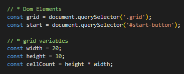
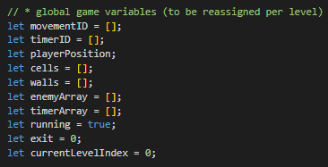
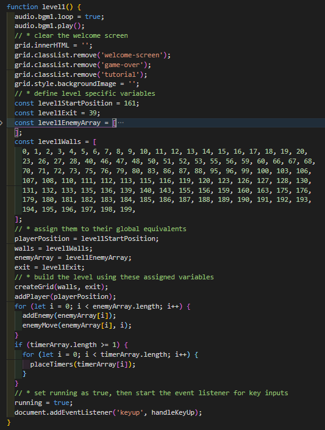

# Project 1 - 'Metal Gear Assembly'

Metal Gear Assembly is a 2D stealth adventure game, inspired by the Metal Gear Solid series. I made this as my first project for the General Assembly Software Engineering Immersive course, as an introduction to **Javascript**.

**Technologies Used** - HTML, CSS, Javascript

**Duration** - 7 days

**[Link](https://calum-m708.github.io/metal-gear-assembly/)**

# The Brief

Create a grid based game using HTML, CSS and Javascript.

For a stealth game, I decided upon two requirements

1. Game Over is triggered when the player collides with either an enemy or their vision
2. Players would have no way to defeat enemies - They must be avoided in order to complete objectives.

As an objective to aim for after getting the basic game built, I decided I wanted the game to have multiple levels, with different objectives and area design for each level.

# Game Overview

The gif below shows a player attempting the first level of the game, eventually being caught by the sight line of one of the enemies.

# Development Overview

I started by whiteboarding the concept in Excalidraw, writing out what I saw as the main challenges and potential for extending the project beyond the MVP (Minimum Viable Product).

After this, I went through a brief process of pseudocoding, before generating the grid and starting work on the coding objectives I had set out on my whiteboard. 

While working I ended up roughly categorising  into four different categories
1. Globally defined `const` variables that affect each level of the game.
2. Empty arrays and other `let` variables that are changed each level.
3. Functions that set up the game and control the action, based on the `let` variables, allowing the functions to be re-used on each level.
4. Functions specific for each individual level, which set the global `let` variables and call other functions.

For example - Here I defined the grid size and dimensions, which remain constant throughout the game. 

Here are the empty arrays and `let` variables that get called and set by the game and level functions 

Here's one of the globally scoped functions. This creates the level using a `for` loop which references the previously defined variables

Here's one of the level specific functions. It sets the global `let` variables and calls the necessary globally scoped functions to run the game

